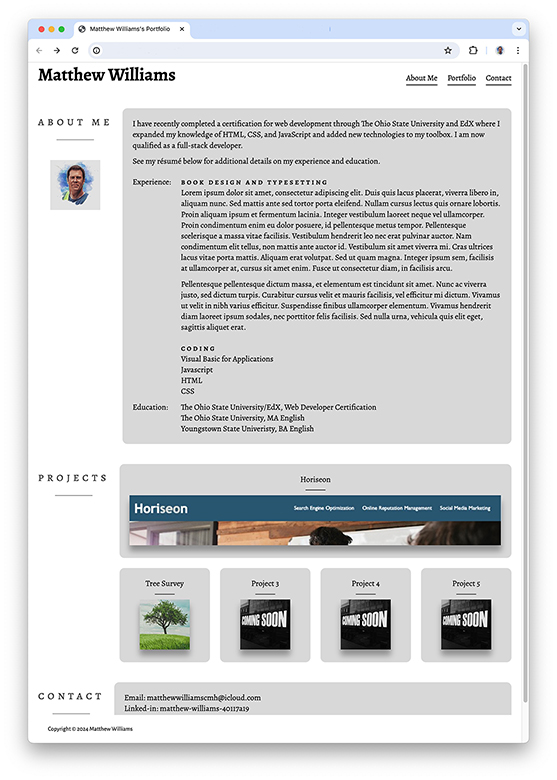

# Project Title

Matthew Williams's Portfolio

## Description

You're looking at Matthew Williams's Portfolio. It attempts to summarize my qualifications both as a coder and as and employee generally. On the page, you'll find information about the kind of work I'm pursuing, a résumé detailing my past work experience and education, links to coding project's I've completed, and a list of ways to contact me.

## Installation

Matthew Williams's Portfolio requires no installation.

## Usage
You can see a screen shot of my portfolio page below. To link to my page, click [here](https://matthewwilliamscmh.github.io/Matthew-Williams-Portfolio).

.

The links at the top of the page will scroll to the relevant sections of the page. In the project's section, click on one of the panels to open that site in a new browser window or tab. The digital addresses in the contact section are hyperlinked to my email address or to the relevant website.

## Credits

I did a lot of googling for how to control the flexbox and grid models for this portfolio. Among the most helpful were [SheCodes](https://www.shecodes.io/athena/), [CSS-Tricks](https://css-tricks.com), [Flexbox Cheatsheet Cheatsheet](https://jonitrythall.com/flexbox-cheatsheet), [MDN Web Docs](https://developer.mozilla.org), and [W3Schools](https://www.w3schools.com).

## Version History

* 0.1
    * Initial Releasse

## License

This portfolio page is licensed under the MIT License - see the LICENSE.md file for details.